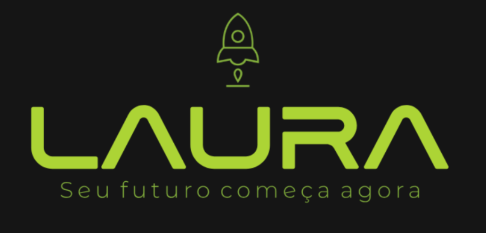
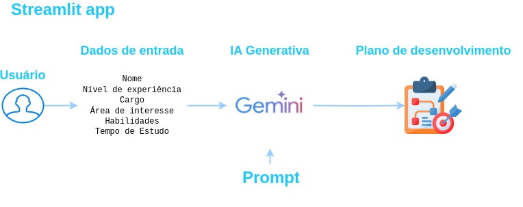
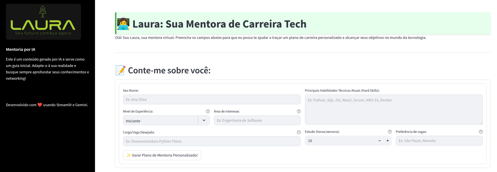

<p align="center">
    
  </a>
</p>


# ✨ Laura: Sua IA Mentora de Carreira Tech ✨


> Pare de navegar no caos da informação. Encontre seu caminho: Laura é sua mentora de carrreira usando IA generativa e parceira para um crescimento tech direcionado e com propósito. ✨

## 💡 Contexto do projeto e Motivação

> Este projeto é a entrega do desafio da **Imersão em IA da Alura**.

<p align="center">
    
    <p align="center" Photo by <a href="https://unsplash.com/@huntersrace?utm_content=creditCopyText&utm_medium=referral&utm_source=unsplash">Hunters Race</a> on <a href="https://unsplash.com/photos/person-standing-near-the-stairs-MYbhN8KaaEc?utm_content=creditCopyText&utm_medium=referral&utm_source=unsplash">Unsplash</a>
    </p>
      
  </a>
</p>

Você sente aquele impulso de levar sua carreira tech para o próximo nível? Sonha em conquistar aquele novo cargo, dominar uma área inovadora ou simplesmente ter clareza sobre os próximos passos?

Se a resposta é sim, você não está sozinho. O universo da tecnologia é vibrante e cheio de oportunidades, mas também pode ser um labirinto. Somos **bombardeados diariamente com uma enxurrada de conteúdos**: cursos que parecem a bala de prata, tecnologias em hype que talvez não se apliquem à sua realidade, e um mar de informação genérica que, muitas vezes, **não faz sentido para a sua jornada individual**.

Essa dificuldade em **filtrar o que é ruído do que é essencial e prático** para alavancar *sua* carreira é um desafio real:

*   Do **iniciante** 🌱 que precisa de um mentor mais de perto para dar os primeiros passos sólidos e evitar se perder no começo.
*   Ao **profissional experiente** 🌳 que busca clareza para atingir novos objetivos, fazer uma transição estratégica ou se aprofundar em nichos específicos com maior impacto.

💡 Foi dessa lacuna – a falta de um roteiro **direcionado, atualizado e focado no seu sucesso individual** – que nasceu **Laura**.


## 🧠 Recursos Principais (Features)

Laura foi projetada para ser sua guia, oferecendo:

*   **🗺️ Plano de Desenvolvimento Personalizado:** Geração de um roadmap de aprendizado adaptado ao seu nível de experiência atual, cargo desejado, área de interesse e disponibilidade de estudo.
*   **📚 Recomendações Curadas e Atuais:** Indicação de cursos, treinamentos, livros e outros recursos de aprendizado **relevantes e atualizados**, filtrando o que está em alta e o que de fato agrega valor prático.
*   **📅 Cronograma de Estudo Detalhado:** Sugestão de um cronograma realista e alcançável para seguir o plano, considerando sua rotina.
*   **🚧 Sugestões de Projetos Práticos:** Ideias de projetos que permitem aplicar o conhecimento adquirido e construir um portfólio sólido.
*   **🏢 Dicas de Empresas:** Identificação de empresas que atuam nas áreas ou tecnologias de interesse do usuário, auxiliando na orientação de futuras candidaturas.
*   **🔍 Busca em Tempo Real:** Utilização da ferramenta Google Search para garantir que as recomendações e informações estejam o mais atualizadas possível.

## 🏛️ Arquitetura

> Essa aplicação foi desenvolvida em Python com Streamlit e Google Gemini


<p align="center">
    
  </a>
</p>


**Fluxo da aplicação:** No dashboard principal o usuário fornece as informações como nome, nível de experiência, cargo, área de interesse, habilidades e tempo de estudo -> Em seguida o backend envia a requisição para o modelo de IA que já possui o prompt de sistema definido e a tool (Google Search) para obter dados atuais -> Assim IA processa e gera o plano -> Que é exibido para o usuário.

## 🚀 Demonstração
> Clique na imagem abaixo para assistir a demo no youtube

[](https://youtu.be/hoQALAtRkp0)


## 🚀 Impacto

O impacto de Laura transcende a simples entrega de informações. Nosso objetivo é:

*   **Reduzir a Sobrecarga:** Diminuir drasticamente o tempo e o esforço que os profissionais gastam tentando encontrar e validar conteúdo relevante.
*   **Aumentar a Eficiência:** Garantir que o tempo de estudo e dedicação seja investido em conteúdos e atividades que realmente acelerem o crescimento e a transição de carreira.
*   **Empoderar Profissionais:** Dar aos indivíduos as ferramentas e o mapa necessários para tomar as rédeas de sua própria jornada de desenvolvimento em um mercado dinâmico.
*   **Facilitar Transições e Crescimento:** Tornar a mudança de cargo, a especialização em uma nova área ou o avanço na carreira um processo mais estruturado e menos intimidador.
*   **Promover Relevância Contínua:** Assegurar que o aprendizado esteja sempre alinhado com as necessidades e realidades atuais do mercado tech.

Laura aspira ser a ferramenta essencial para qualquer profissional de tecnologia que busca clareza, direção e um guia confiável em sua evolução de carreira.

## 🛠️ Como Usar/Instalar

*   *Para rodar localmente*
    1.  Clone o repositório:
        ```bash
        git clone https://github.com/PJarbas/laura.git
        ```
    
    2.  Instale as dependências (Python):
        ```bash
        pip install -r requirements.txt
        ```
    
    3.  Configure as variáveis de ambiente (API Keys para Google Gemini). Veja o arquivo `.env.example`.

    5.  Execute a aplicação:
        ```bash
        cd app/
        streamlit run app.py
        ```
    6.  Acesse a aplicação em seu navegador (geralmente `http://localhost:PORTA`).

## 🤝 Contribuição

Contribuições são **muito bem-vindas**! Se você tem ideias para melhorar Laura, encontrou um bug ou quer adicionar uma nova feature, por favor:

1.  Faça um fork do repositório.
2.  Crie uma nova branch (`git checkout -b feature/sua-feature`).
3.  Faça suas alterações.
4.  Commit suas alterações (`git commit -m 'feat: Adiciona nova feature X'`).
5.  Envie para a branch (`git push origin feature/sua-feature`).
6.  Abra um Pull Request detalhando as mudanças.


## 📄 Licença

Este projeto está sob a licença MIT. Veja o arquivo `LICENSE` para mais detalhes.

